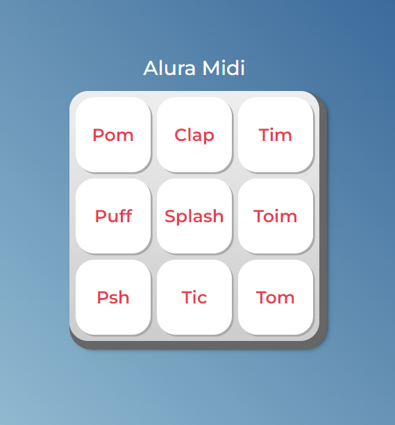

# Projeto Alura Space

Projeto de desenvolvimento web realizado com Django.

| :placard: Vitrine.Dev |     |
| -------------  | --- |
| :sparkles: Nome        | **Projeto Alura Midi**
| :label: Tecnologias | HTML5, CSS3, JavaScript
| :rocket: URL         | thamyresmya.github.io/Alura_Midi/
| :fire: Desafio     | 

  <a href="#-tecnologias">Tecnologias</a>&nbsp;&nbsp;&nbsp;|&nbsp;&nbsp;&nbsp;  
  <a href="#-projeto">Projeto</a>&nbsp;&nbsp;&nbsp;|&nbsp;&nbsp;&nbsp;  
  <a href="#-gif">Gif</a>&nbsp;&nbsp;&nbsp;&nbsp;&nbsp;&nbsp;

 

## 🚀 Tecnologias

Esse projeto foi desenvolvido com as seguintes tecnologias:

- HTML5
- CSS3
- JavaScript
- Git e Github

 

## 💻 Projeto

Projeto realizado com HTML5, CSS3, JavaScript. 
Alura Midi é um projeto que apresenta 9 opções de som de percussão, que emite o som de acordo com a tecla clicada.

 

## 📸 Gif
Pagina do Alura Midi

</img>

 

---

Feito com ♥ by Thamyres Cavalcante.

